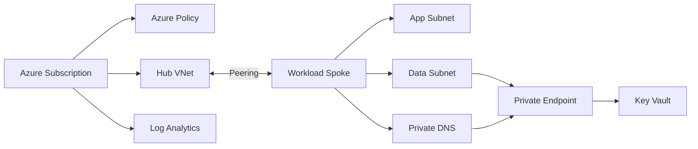

# Azure Enterprise Landing Zone with Terraform

[](https://github.com/ugochuk/azure-enterprise-landing-zone/actions/workflows/terraform-ci.yml)

Enterprise-style Azure landing zone built with Terraform to demonstrate reusable infrastructure modules, secure networking, private connectivity, governance-as-code, CI validation, and operational readiness.

## What this project demonstrates

- Terraform Infrastructure as Code and reusable modules
- Azure hub-and-spoke networking and VNet peering
- Subnet segmentation and network security groups
- Azure Key Vault using RBAC authorization
- Private Endpoints and Azure Private DNS
- Public network access disabled for protected services
- Centralized Log Analytics foundation
- Azure Policy represented as code
- Separate development and production configuration
- GitHub Actions for Terraform formatting, validation, and IaC security scanning
- Production-minded naming, tagging, outputs, and documentation

## Architecture



See [docs/architecture.md](docs/architecture.md) for the security model and detailed design.

## Repository structure

```text
.
├── .github/workflows/
│   └── terraform-ci.yml
├── docs/
│   └── architecture.md
├── environments/
│   ├── dev/terraform.tfvars
│   └── prod/terraform.tfvars
├── modules/
│   ├── keyvault/
│   ├── monitoring/
│   └── network/
├── governance.tf
├── main.tf
├── outputs.tf
├── providers.tf
├── variables.tf
└── versions.tf
```

## Design decisions

### Hub-and-spoke networking

Shared connectivity and workload resources are separated so additional spokes can be introduced without redesigning the platform foundation.

### Private-by-default secrets platform

Azure Key Vault has public network access disabled. Access is provided through a Private Endpoint in the workload network and resolved using Azure Private DNS.

### RBAC authorization

Key Vault uses Azure RBAC instead of legacy vault access policies, providing an identity model that can be extended to managed identities and workload-specific roles.

### Governance as code

A subscription-level Azure Policy assignment demonstrates how organizational requirements can be versioned and reviewed alongside Terraform infrastructure.

### Automated quality gates

GitHub Actions runs `terraform fmt`, `terraform init -backend=false`, `terraform validate`, and a Trivy IaC security scan. Pull requests therefore receive infrastructure validation before changes reach the main branch.

## Prerequisites

- Terraform >= 1.6
- Azure CLI
- Azure subscription
- Permissions to create the demonstrated resources and subscription policy assignment

Authenticate:

```bash
az login
az account set --subscription <subscription-id>
```

Initialize and validate:

```bash
terraform init
terraform fmt -check -recursive
terraform validate
```

Plan development:

```bash
terraform plan -var-file=environments/dev/terraform.tfvars
```

Apply only when using a non-production Azure subscription intended for testing:

```bash
terraform apply -var-file=environments/dev/terraform.tfvars
```

## CI/CD

The included GitHub Actions workflow intentionally performs validation and security scanning without automatically applying infrastructure. In an enterprise implementation, deployment would normally use workload identity federation/OIDC, protected GitHub environments, required reviewers, and separate plan/apply stages.

## Security note

This is an original portfolio implementation. It contains no employer source code, customer information, credentials, tenant IDs, subscription IDs, or internal architecture.

## Next enhancements

- Workload identity federation for deployments
- Remote Terraform state and state locking
- Azure Firewall / routing module
- Diagnostic settings for platform resources
- Defender for Cloud integration
- Automated Terraform tests
