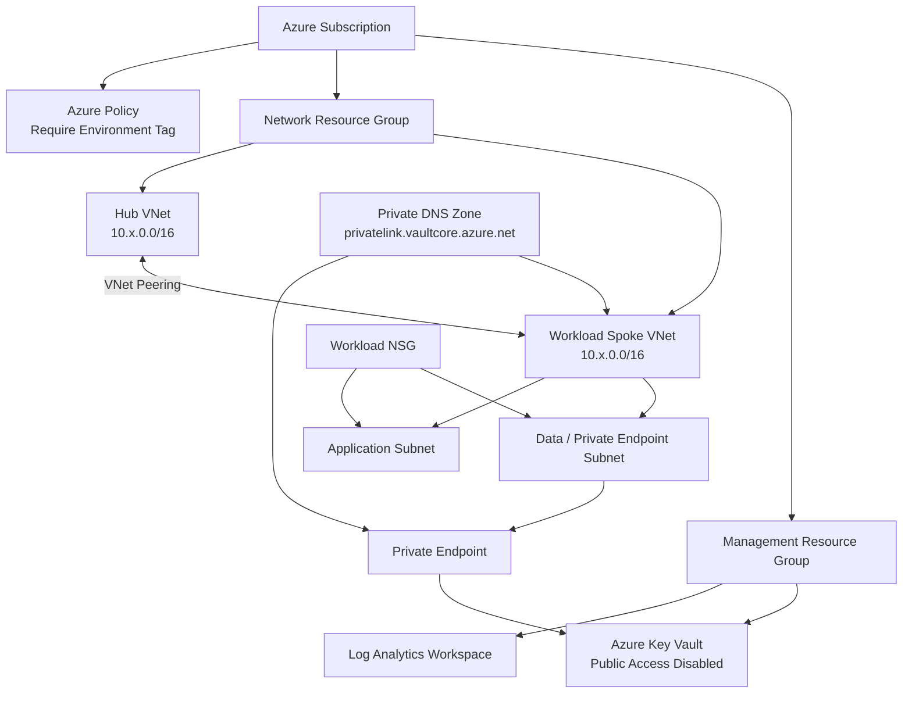

# Architecture and Security Design

## Overview

This project models a small enterprise Azure landing zone with clear separation between connectivity, workloads, management services, and governance.

## Security principles

### Private-by-default service access

Key Vault disables public network access and is exposed to the workload network through an Azure Private Endpoint. A Private DNS zone provides name resolution to the private address.

### RBAC instead of legacy access policies

Key Vault uses Azure RBAC authorization. This provides a consistent identity and authorization model that can be integrated with managed identities and privileged access workflows.

### Network segmentation

Hub and workload spoke networks use separate address spaces. Workload subnets are associated with a network security group and can be extended with workload-specific rules without changing the shared hub.

### Centralized observability

A dedicated management resource group hosts Log Analytics. Additional diagnostic settings can be attached to platform resources as the architecture expands.

### Governance as code

Azure Policy assignments are represented in Terraform alongside infrastructure. The example requires an Environment tag at subscription scope, demonstrating how organizational controls can be versioned and reviewed with infrastructure changes.

## Production considerations

A real enterprise implementation would typically extend this design with Azure Firewall or a third-party NVA, centralized DNS forwarding, DDoS Network Protection where required, management groups, multiple subscriptions, remote Terraform state, workload-specific route tables, Defender for Cloud, diagnostic settings, privileged identity management, and separate deployment identities.
